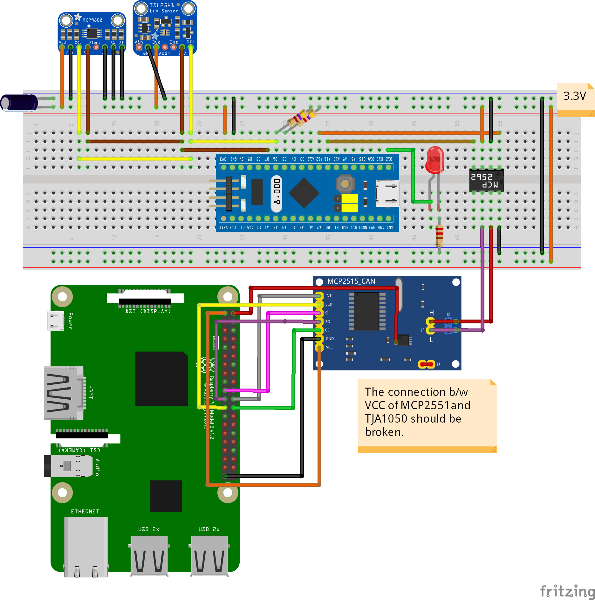

# RPiCAN
This project aims to provide CAN communication between a Raspberry Pi and an STM32 device. 

## STM32
We're using the STM32f103c8 device that is connected through I2C bus to a MCP9808 temperature sensor and a TSL2851 luminosity sensor. The bluepill is connected also to a LED. The sensors provide their measures to the STM32f103c8 device each 10 seconds. These measures are then sent in a CAN frame on the bus to be captured by the Raspberry Pi. The LED state is determinated following a detection of a special CAN frame on the bus.

CAN Frame data field format:
* Temperature : DLC=3 | Data1stByte=0x11 | Data2ndByte and Data3rdByte = Temp
* Luminosity :  DLC=3 | Data1stByte=0x22 | Data2ndByte and Data3rdByte = Lux
* LED :         DLC=2 | Data1stByte=0x33 | Data2ndByte = LED State

The STM32f103c8 is connected through its CAN Pins (A11:CANRx| A12:CANTx) with a CAN transceier to provide CANH and CANL differential signal.

## Raspberry Pi
The Raspberry Pi does not have a CAN interface, so it does know how to communicate on a CAN bus by default. 
To use CAN protocol on the Raspberry Pi, we can take advantage of the SPI interface with the help of the MCP2515. This circuit converts SPI to CAN (CANTx and CANRx).
The HW-184 module contains an MCP2515 chip alongside a CAN transceiver, so it takes as an input an SPI frame and converts it to a CAN frame in differential signal (Or the other way around).
However, the transceiver chip in this module must be powered up with 5v to work, and its Vcc is connected to the Vcc of the MCP2515 chip, which both are connected to the Vcc of the whole module. Knowing that the Raspberry Pi's GPIOs have a maximum voltage support of 3.3v, connecting it to the 5v module HW-184 will fry it. Thus we can not use the module as it is. The two power pins of the two chips need to be disconnected, and the MCP2515 should be powered with a 3v3 voltage, while keeping the transceiver voltage at 5v as it does not connect with the Raspberry Pi, and it interpretates the 3v3 voltage based output pins CANRx and CANTx of the MCP2515 as a logical 1.
The full process of making this adjusment is found on this [link] (https://forums.raspberrypi.com/viewtopic.php?t=141052).

The code provided for the Raspberry Pi should be executed for it to keep listening to incoming frames on the CAN bus, with the capability to send its own through Domoticz.

## Domoticz
Domoticz is a Home Automation System that lets you monitor and configure various devices like: Lights, Switches, various sensors/meters like Temperature, Rain, Wind, UV, Electra, Gas, Water and much more. We will be using that in this project to give an interface to display current measures and to control the state of the LED.
Communications between the Raspberry Pi and Domoticz are made with MQTT.

## Architecture

## Wiring

